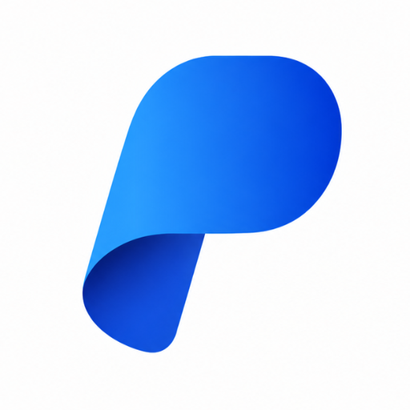

<p align="center">
  
</p>

# PunyaKios Merchant SDK

Library resmi untuk memudahkan integrasi Merchant API PunyaKios.

## 📁 Struktur Library
- `/php`: SDK untuk PHP (Curl based)
- `/nodejs`: SDK untuk Node.js (Fetch based)
- `/javascript`: SDK untuk Browser/Client-side

## 🌐 Manual API Integration
Jika kamu tidak ingin menggunakan SDK, kamu bisa melakukan request manual menggunakan `cURL` atau HTTP Client lainnya.

**Base URL:** `https://punyakios.web.id/api/merchant`
 
**Headers:**
- `X-API-Key`: (API Key Merchant kamu)
- `Content-Type`: `application/json`
- `Accept`: `application/json`

### 1. Create Payment (QRIS)
```bash
curl -X POST https://punyakios.web.id/api/merchant/payment-request \
  -H "X-API-Key: YOUR_API_KEY" \
  -H "Content-Type: application/json" \
  -d '{
    "external_id": "ORD-123",
    "amount": 10000,
    "description": "Pembayaran Kopi",
    "callback_url": "https://websitemu.com/callback"
  }'
```

### 2. Get Merchant Profile
```bash
curl -X POST https://punyakios.web.id/api/merchant/profile \
  -H "X-API-Key: YOUR_API_KEY"
```

### 3. Get Transactions
```bash
curl -X POST https://punyakios.web.id/api/merchant/check-status \
  -H "X-API-Key: YOUR_API_KEY" \
  -H "Content-Type: application/json" \
  -d '{ "external_id": "ORD-123" }'
```

## 🚀 Penggunaan Library (SDK)

## 🐘 PHP Usage

```php
require_once 'lib/php/PunyaKios.php';
use PunyaKios\PunyaKios;

$sdk = new PunyaKios('YOUR_API_KEY');

// Create QRIS
$response = $sdk->createPaymentRequest([
    'external_id' => 'ORDER-101',
    'amount' => 10000,
    'description' => 'Pembayaran Kopi',
    'callback_url' => 'https://websitemu.com/callback.php' // URL untuk terima notifikasi lunas
]);

// Cek Profil Merchant
$profile = $sdk->getProfile();

// Cek Riwayat Transaksi
$history = $sdk->getTransactions();

// Cek Status Transaksi Spesifik
$status = $sdk->getTransactionStatus('ORD-101');
```

---

## 🟢 Node.js Usage (v18+)

```javascript
const PunyaKios = require('./lib/nodejs/PunyaKios');

const sdk = new PunyaKios('YOUR_API_KEY');

// Create QRIS
sdk.createPaymentRequest({...});

// Cek Riwayat
sdk.getTransactions().then(res => console.log(res));

// Cek Status
sdk.getTransactionStatus('ORD-101').then(res => console.log(res));

async function test() {
    // Create QRIS
    const response = await sdk.createPaymentRequest({
        external_id: 'ORDER-102',
        amount: 15000,
        description: 'Pembayaran Snack',
        callback_url: 'https://websitemu.com/callback'
    });
    
    // Cek Status
    const status = await sdk.getTransactionStatus('ORDER-102');
    console.log(status.data.status);
}
test();
```

---

## 🌐 Browser JavaScript Usage

```html
<script src="lib/javascript/punyakios-sdk.js"></script>
<script>
    const sdk = new PunyaKios('YOUR_API_KEY');

    // Ambil Riwayat
    sdk.getTransactions().then(res => {
        console.log("Riwayat:", res.data);
    });

    // Contoh buat request dengan callback
    /*
    sdk.createPaymentRequest({
        external_id: 'ORDER-103',
        amount: 20000,
        description: 'Topup Games',
        callback_url: 'https://websitemu.com/callback'
    });
    */
</script>
```

---

## 🔔 Handling Callback

PunyaKios akan mengirimkan POST request ke `callback_url` kamu saat pembayaran berhasil.

### PHP Callback Example
Buat file `callback.php`:
```php
require_once 'lib/php/PunyaKios.php';
use PunyaKios\PunyaKios;

$data = PunyaKios::parseCallback();

if ($data && $data['status'] === 'PAID') {
    $orderId = $data['external_id'];
    $amount = $data['amount'];
    // Update status pesanan di database kamu
    
    echo json_encode(['status' => 'success']);
}
```

### Callback JSON Format
Berikut adalah format JSON yang akan dikirimkan oleh PunyaKios ke `callback_url` kamu:

```json
{
    "external_id": "ORDER-101",
    "status": "PAID",
    "amount": 10000,
    "payment_method": "QRIS",
    "timestamp": "2026-05-13T02:27:00.000Z"
}
```

### Node.js (Express) Callback Example
```javascript
const PunyaKios = require('./lib/nodejs/PunyaKios');

app.post('/callback', (req, res) => {
    const data = PunyaKios.parseCallback(req.body);
    
    if (data.status === 'PAID') {
        console.log(`Order ${data.external_id} LUNAS!`);
    }
    
    res.json({ message: 'OK' });
});
```

---

## 🛡️ Keamanan
- Jangan pernah membagikan `API_KEY` kamu secara publik.
- Untuk penggunaan di browser, pastikan kamu menggunakan `API_KEY` hanya di lingkungan yang terproteksi atau gunakan backend proxy untuk keamanan maksimal.

## 📝 Contoh Respon API

### Sukses (200 OK)
```json
{
    "status": "success",
    "message": "Payment request created",
    "data": {
        "checkout_url": "https://punyakios.web.id/pay/8kR2mN9pLwXz4qYt",
        "external_id": "ORD-123",
        "qris_string": "00020101021226650013...",
        "amount": 10000
    }
}
```

### Response: Profil Merchant
```json
{
    "status": true,
    "message": "Merchant profile retrieved successfully",
    "data": {
        "id": 123,
        "name": "Budi Santoso",
        "username": "budi_merchant",
        "email": "budi@email.com",
        "phone": "08123456789",
        "business_name": "Toko Budi Digital",
        "created_at": "2026-05-13T02:00:00.000000Z",
        "updated_at": "2026-05-13T02:00:00.000000Z"
    }
}
```

### Response: Cek Riwayat Transaksi
```json
{
    "status": "success",
    "data": [
        {
            "external_id": "ORD-101",
            "slug": "8kR2mN9pLwXz4qYt",
            "amount": 10000,
            "status": "success",
            "created_at": "2026-05-13 03:00:00"
        }
    ],
    "pagination": {
        "total": 1,
        "current_page": 1,
        "last_page": 1
    }
}
```

### Response: Cek Status Transaksi
```json
{
    "status": "success",
    "data": {
        "external_id": "ORD-101",
        "slug": "8kR2mN9pLwXz4qYt",
        "amount": 10000,
        "status": "success",
        "description": "Pembayaran Tagihan",
        "created_at": "2026-05-13 03:00:00",
        "paid_at": "2026-05-13 03:05:00",
        "qris_string": "00020101021226650013..."
    }
}
```

### Error Validasi (400 Bad Request)
```json
{
    "status": "error",
    "message": "Validation Error",
    "errors": {
        "amount": ["The amount must be at least 1000."]
    }
}
```

### Error Sistem (500 Internal Server Error)
```json
{
    "status": "error",
    "message": "PunyaKios System Error: PunyaKios API Error: Duplicated external_id..."
}
```
